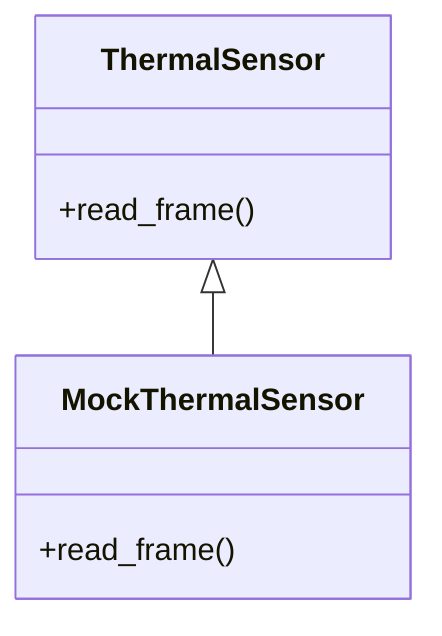
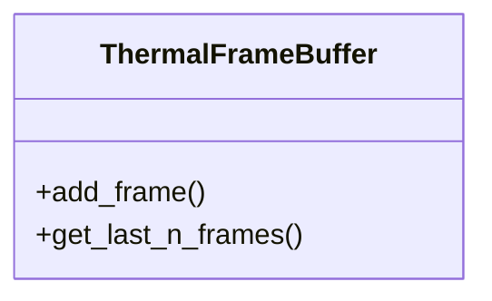
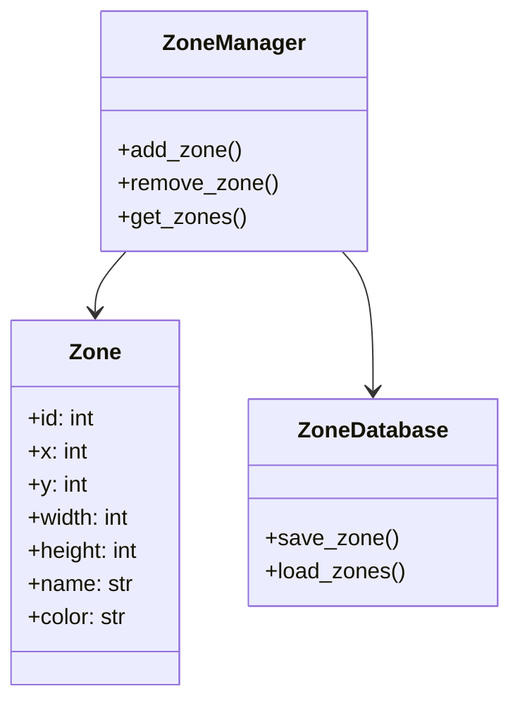
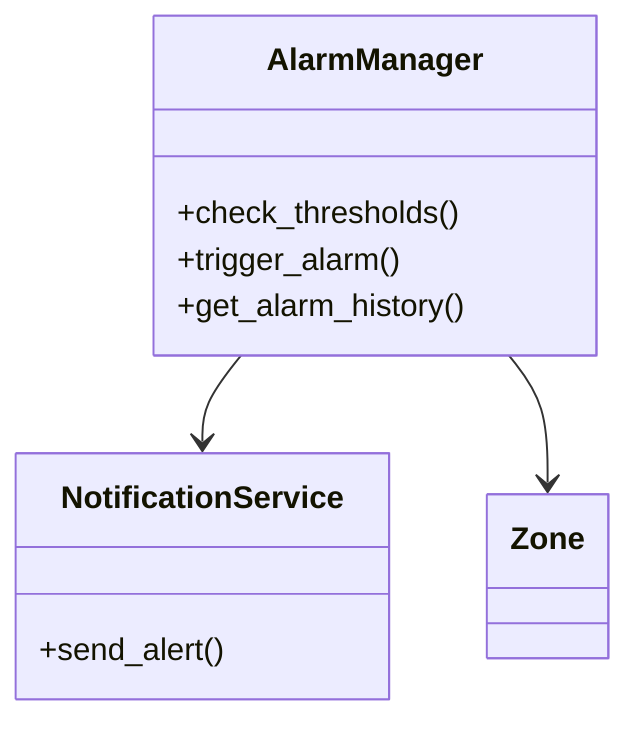
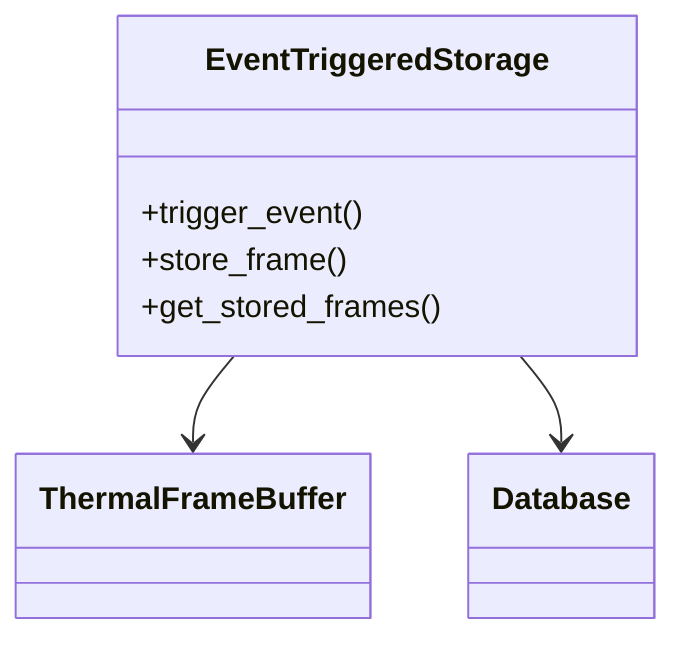
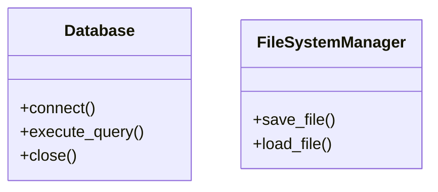
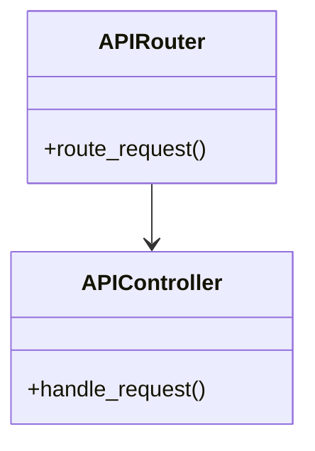
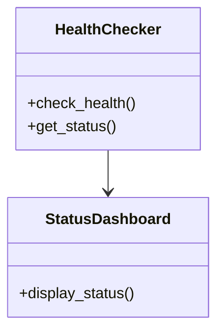
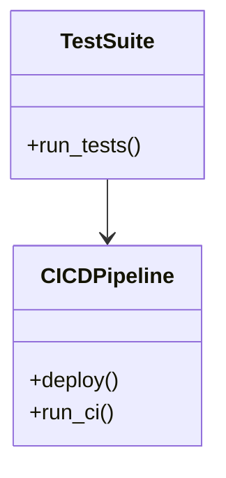
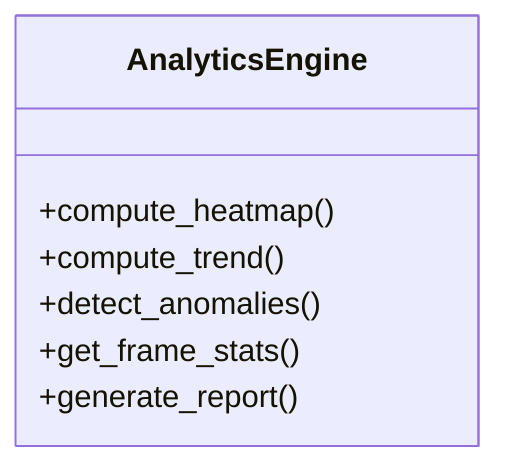

# IR Thermal Monitoring System Backend: Subsystem Logic Overviews (Non-Programmer Friendly)

## Quick Start
1. **Clone the repository:**
   ```powershell
   git clone <your-repo-url>
   cd IRCAM V24
   ```
   ```bash
   git clone <your-repo-url>
   cd IRCAM\ V24
   ```
2. **Create and activate a virtual environment:**
   ```powershell
   python -m venv .venv
   .venv\Scripts\activate
   ```
   ```bash
   python3 -m venv .venv
   source .venv/bin/activate
   ```
3. **Install dependencies:**
   ```powershell
   pip install -r requirements.txt
   pip install -r requirements-dev.txt
   ```
   ```bash
   pip install -r requirements.txt
   pip install -r requirements-dev.txt
   ```
4. **Run the backend with the mock sensor (no hardware required):**
   ```powershell
   $env:MOCK_SENSOR=1
   uvicorn backend.src.main:app --reload
   ```
   ```bash
   export MOCK_SENSOR=1
   uvicorn backend.src.main:app --reload
   ```
5. **Open the API docs:**
   - Visit [http://127.0.0.1:8000/docs](http://127.0.0.1:8000/docs) in your browser.

---

This document explains how each part of the backend system works, step by step, in plain language. It is designed for anyone who wants to understand the system, even without a programming background.

---

## 1. Sensor Handling

### What is it?
This part of the system is responsible for reading temperature data from a special camera (the MLX90640 sensor) or, for testing, generating fake temperature data.

### How does it work?
1. **Choosing the Data Source**
   - When the system starts, it checks if it should use the real sensor or a fake one (for testing). This is controlled by a setting called `MOCK_SENSOR`.
2. **Getting a Temperature Snapshot**
   - The system asks the sensor for a snapshot, which is a grid of 768 temperature values (imagine a thermal photo).
3. **Handling Problems**
   - If the sensor fails or has trouble, the system tries again and records any errors for later review.

### In Simple Terms
- The system can use a real camera or a fake one for testing.
- It takes a thermal snapshot on request.
- If something goes wrong, it tries again and keeps a record of the problem.

[See detailed class/method table in the Appendix: [Sensor Handling](#sensor-handling-1)]

---

## 2. Frame Buffering

### What is it?
This is like a rolling photo album that always keeps the most recent thermal snapshots.

### How does it work?
1. **Setting Up the Album**
   - The system creates a special memory area that can hold about 10 minutes of snapshots.
2. **Saving New Snapshots**
   - Every time a new snapshot is taken, it is added to the album. If the album is full, the oldest snapshot is thrown out to make room for the new one.
3. **Looking Back in Time**
   - The system can quickly look back at the most recent snapshots, which is useful if something important happens.

### In Simple Terms
- The system always keeps the latest 10 minutes of thermal images.
- New images replace the oldest ones.
- It can quickly find recent images if needed.

[See detailed class/method table in the Appendix: [Frame Buffering](#frame-buffering-1)]

---

## 3. Zone Management

### What is it?
Zones are special areas on the thermal image that you want to watch closely (for example, a machine or doorway).

### How does it work?
1. **Defining Zones**
   - Users can draw up to two rectangles on the thermal image to mark areas of interest.
2. **Saving Zones**
   - These zones are saved so the system remembers them, even if restarted.
3. **Watching Zones**
   - For every new snapshot, the system checks the temperature inside each zone.

### In Simple Terms
- You can tell the system which areas to watch.
- The system remembers these areas.
- It checks the temperature in each area every time it takes a new snapshot.

[See detailed class/method table in the Appendix: [Zone Management](#zone-management-1)]

---

## 4. Alarm System

### What is it?
This part watches for temperatures that are too high in your zones and alerts you if something is wrong.

### How does it work?
1. **Setting Temperature Limits**
   - You can set a maximum temperature for each zone.
2. **Checking Temperatures**
   - Every time a new snapshot is taken, the system checks if any zone is too hot.
3. **Triggering an Alarm**
   - If a zone is too hot, the system records an alarm event with details (when, where, how hot).
4. **Sending Alerts**
   - The system sends real email notifications (via SMTP) to configured recipients when an alarm is triggered. Notification settings are persistent and configurable via API. Delivery errors are logged.
5. **Starting Event Recording**
   - When an alarm happens, the system prepares to save extra data before and after the event.

### In Simple Terms
- You set temperature limits for important areas.
- The system checks these limits every time.
- If a limit is crossed, it records an alarm and sends an email notification.
- All notification settings are persistent and configurable.

[See detailed class/method table in the Appendix: [Alarm System](#alarm-system-1)]

---

## 5. Event-Triggered Frame Storage

### What is it?
This part saves a "movie" of what happened before and after an alarm.

### How does it work?
1. **Saving Before the Alarm**
   - When an alarm happens, the system grabs the last 5 minutes of snapshots from its album.
2. **Saving After the Alarm**
   - It then keeps saving new snapshots for the next 5 minutes.
3. **Storing the Event**
   - Both sets of snapshots (before and after) are saved together in the database, linked to the alarm.
4. **Not Slowing Down**
   - The system does this in the background so it doesn’t slow down other work.

### In Simple Terms
- When something important happens, the system saves what it saw before and after.
- This lets you review the whole event later, like watching a replay.

[See detailed class/method table in the Appendix: [Event-Triggered Frame Storage](#event-triggered-frame-storage-1)]

---

## 6. Database & Persistence

### What is it?
This is the system’s memory, where it saves all important information so nothing is lost.

### How does it work?
1. **Setting Up the Database**
   - The system uses a reliable database (SQLite) and tunes it for speed and safety.
2. **Organizing Information**
   - It creates tables for snapshots, events, alarms, and zones.
3. **Safe Saving**
   - Every time it saves or updates information, it does so in a way that protects against data loss.

### In Simple Terms
- All important data is saved in a safe, organized way.
- The system is designed to avoid losing data, even if something goes wrong.

[See detailed class/method table in the Appendix: [Database & Persistence](#database--persistence-1)]

---

## 7. API Layer

### What is it?
This is how other programs (like a web dashboard) talk to the backend to get data or control it.

### How does it work?
1. **Providing Access**
   - The system offers a set of web addresses (endpoints) where you can ask for data or send commands.
2. **Choosing the Sensor**
   - The system automatically uses the real or fake sensor, depending on the settings.
3. **Checking Inputs**
   - It checks all requests to make sure they are valid and safe.

### In Simple Terms
- The backend can be controlled and monitored from other programs or dashboards.
- It always checks that requests are safe and make sense.

[See detailed class/method table in the Appendix: [API Layer](#api-layer-1)]

---

## 8. System Health Monitoring

### What is it?
This part checks that all other parts of the system are working correctly.

### How does it work?
1. **Regular Checks**
   - The system regularly checks the sensor, database, frame buffer, and alarm system.
2. **Making a Report**
   - It combines the results into a single health report.
3. **Sharing the Report**
   - The health report is available through the API for anyone who needs to monitor the system.

### In Simple Terms
- The system keeps an eye on itself and reports if anything is wrong.

[See detailed class/method table in the Appendix: [System Health Monitoring](#system-health-monitoring-1)]

---

## 9. Testing & Quality Assurance

### What is it?
This ensures the system works correctly and is reliable.

### How does it work?
1. **Testing Each Part**
   - Every part of the system is tested separately to make sure it works.
2. **Testing Everything Together**
   - The whole system is tested as a unit to make sure all parts work together.
3. **Keeping Quality High**
   - The system is checked for mistakes, and the code is kept clean and organized.

### In Simple Terms
- The system is thoroughly tested to make sure it works and is reliable.

[See detailed class/method table in the Appendix: [Testing & Quality Assurance](#testing--quality-assurance-1)]

---

## 10. Analytics & Reporting

### What is it?
This part provides advanced data analysis, reporting, and export features for historical and real-time thermal data.

### How does it work?
1. **Generating Analytics**
   - The system can compute heatmaps, trends, and detect anomalies for any zone and time range via `/api/v1/analytics/heatmap`, `/api/v1/analytics/trends`, and `/api/v1/analytics/anomalies`.
2. **Exporting Data**
   - Users can export frame data as CSV, including per-frame statistics, for further analysis using `/api/v1/frames/export?overlay=stats`.
3. **Generating Reports**
   - The system can generate summary, trend, and anomaly count reports for any zone and time range via `/api/v1/reports`.

### In Simple Terms
- The backend can analyze, summarize, and export thermal data for deeper insights.
- All analytics and reporting features are available via API endpoints.

[See detailed class/method table in the Appendix: [Analytics & Reporting](#analytics--reporting-1)]

---

## 11. Alarm/Event Management & Frame Export

### What is it?
This part manages alarm events, event frame retrieval, and provides access to raw and processed frame data for frontend and analysis use.

### How does it work?
1. **Alarm History and Acknowledge**
   - Retrieve a list of all alarm events and their details using `/api/v1/alarms/history`.
   - Acknowledge or reset alarms using `/api/v1/alarms/acknowledge` (POST).
   - When an alarm is triggered, a real email notification is sent to all configured recipients (see Notifications section).
2. **Event Frame Retrieval and Export**
   - Retrieve all frames associated with a specific event using `/api/v1/events/{event_id}/frames` (JSON metadata) and `/api/v1/events/{event_id}/frames.png` (PNG image export).
   - Retrieve all frame blobs for an event (base64-encoded, with metadata) using `/api/v1/events/{event_id}/frames/blobs`.
   - (Optional) Retrieve a single frame blob using `/api/v1/frames/{frame_id}/blob` (if implemented).
3. **Frame Export for Analysis**
   - Export all frames (with optional overlays/statistics) as CSV for further analysis or reporting.

### In Simple Terms
- You can view, acknowledge, and manage alarm events.
- You can retrieve and export all frames for any event, including as images or raw data.
- The backend supports all data needed for frontend video/gif generation and advanced analytics.

---

## 12. Frontend Integration & Advanced Features

### What is it?
The backend is designed to support a feature-rich frontend, including event video/gif generation, advanced analytics, and future extensibility.

### How does it work?
- All endpoints provide data in formats suitable for direct frontend use (JSON, CSV, PNG, base64 blobs).
- The frontend can generate event videos/gifs by retrieving event frames and assembling them client-side.
- Backend performance is optimized for analytics and export; numpy is used for speed, and further optimizations are possible if needed.
- Optional advanced features (notification delivery, advanced event/alarm management, log retrieval, user management) can be added as needed.

### In Simple Terms
- The backend is ready for modern frontend features, including video/gif generation from event frames.
- All core and advanced APIs are implemented, tested, and documented. Optional features can be prioritized as needed.

---

# Appendix: Classes, Methods, and Functions
## Overview
This appendix provides detailed information about the classes, methods, and functions used in the IR Thermal Monitoring System, including their purpose, parameters, and usage.

## Legend
- **Parameters:** Arguments passed to the method/function.
- **Returns:** The type of value returned by the method/function.
- **Color Coding:**
    - <span style="color: #00AA00">Green</span>: Core logic
    - <span style="color: #0077CC">Blue</span>: API/Interface
    - <span style="color: #CC7700">Orange</span>: Persistence/Storage

## Components
- **Class Diagrams:** Visual representations of the system classes and their relationships.

### Sensor Handling {#sensor-handling-1}

| Class             | Method        | Parameters | Returns | Description                                      |
|-------------------|--------------|------------|---------|--------------------------------------------------|
| ThermalSensor     | read_frame() | None       | list[float] | Gets a new thermal snapshot (768 values).        |
| MockThermalSensor | read_frame() | None       | list[float] | Returns a fake thermal snapshot for testing.     |

---

### Frame Buffering {#frame-buffering-1}

| Class              | Method              | Parameters | Returns | Description                                      |
|--------------------|--------------------|------------|---------|--------------------------------------------------|
| ThermalFrameBuffer | add_frame()        | frame: list[float] | None | Adds a new snapshot to the buffer.               |
| ThermalFrameBuffer | get_last_n_frames()| n: int     | list[list[float]] | Retrieves the most recent N snapshots.           |

---

### Zone Management {#zone-management-1}

| Class         | Method        | Parameters | Returns | Description                                      |
|---------------|--------------|------------|---------|--------------------------------------------------|
| ZoneManager   | add_zone()   | zone: Zone | None    | Adds a new zone with name and color.              |
| ZoneManager   | remove_zone()| zone_id: int | None   | Removes a zone by ID.                            |
| ZoneManager   | get_zones()  | None       | list[Zone] | Retrieves all defined zones.                      |
| ZoneDatabase  | save_zone()  | zone: Zone | None    | Persists a zone to the database.                  |
| ZoneDatabase  | load_zones() | None       | list[Zone] | Loads all zones from the database.                |

---

### Alarm System {#alarm-system-1}

| Class              | Method            | Parameters | Returns | Description                                      |
|--------------------|------------------|------------|---------|--------------------------------------------------|
| AlarmManager       | check_thresholds()| None       | list[AlarmEvent] | Checks if any zone is too hot.                   |
| AlarmManager       | trigger_alarm()   | zone_id: int, temp: float | AlarmEvent | Triggers an alarm for a zone.                    |
| AlarmManager       | get_alarm_history()| None      | list[AlarmEvent] | Retrieves alarm history.                        |
| NotificationService| send_alert()      | message: str | None  | Sends an alert/notification.                     |

---

### Event-Triggered Frame Storage {#event-triggered-frame-storage-1}

| Class                 | Method           | Parameters | Returns | Description                                      |
|-----------------------|------------------|------------|---------|--------------------------------------------------|
| EventTriggeredStorage | trigger_event()  | event: AlarmEvent | None | Saves pre- and post-alarm snapshots.             |
| EventTriggeredStorage | store_frame()    | frame: list[float] | None | Stores a frame to persistent storage.            |
| EventTriggeredStorage | get_stored_frames()| event_id: int | list[list[float]] | Retrieves stored frames for an event.          |

---

### Database & Persistence {#database--persistence-1}

| Class             | Method         | Parameters | Returns | Description                                      |
|-------------------|---------------|------------|---------|--------------------------------------------------|
| Database          | connect()      | None       | Connection | Opens a connection to the database.              |
| Database          | execute_query()| query: str | Any    | Runs a command to save or get data.              |
| Database          | close()        | None       | None   | Closes the database connection.                  |
| FileSystemManager | save_file()    | path: str, data: Any | None | Saves data to a file.                            |
| FileSystemManager | load_file()    | path: str  | Any    | Loads data from a file.                          |

---

### API Layer {#api-layer-1}

| Class         | Method         | Parameters | Returns | Description                                      |
|--------------|---------------|------------|---------|--------------------------------------------------|
| APIRouter    | route_request()| request: Request | Response | Routes incoming API requests.                    |
| APIController| handle_request()| request: Request | Response | Handles business logic for API endpoints.        |

---

### System Health Monitoring {#system-health-monitoring-1}

| Class           | Method         | Parameters | Returns | Description                                      |
|-----------------|---------------|------------|---------|--------------------------------------------------|
| HealthChecker   | check_health() | None       | dict    | Monitors health of subsystems.                   |
| HealthChecker   | get_status()   | None       | dict    | Retrieves current system status.                 |
| StatusDashboard | display_status()| status: dict | None  | Shows system health to users/admins.            |

---

### Testing & Quality Assurance {#testing--quality-assurance-1}

| Class        | Method      | Parameters | Returns | Description                                      |
|--------------|------------|------------|---------|--------------------------------------------------|
| TestSuite    | run_tests() | None      | bool    | Runs automated tests for the system.             |
| CICDPipeline | deploy()    | env: str  | None    | Deploys the system to staging/production.        |
| CICDPipeline | run_ci()    | None      | None    | Runs continuous integration pipeline.            |

---

### Analytics & Reporting {#analytics--reporting-1}

| Class           | Method             | Parameters                        | Returns         | Description                                      |
|-----------------|--------------------|------------------------------------|-----------------|--------------------------------------------------|
| AnalyticsEngine | compute_heatmap()  | zone_id: int, start, end          | dict            | Computes a heatmap for a zone and time range.    |
| AnalyticsEngine | compute_trend()    | zone_id: int, start, end          | dict            | Computes temperature trends for a zone.          |
| AnalyticsEngine | detect_anomalies() | zone_id: int, start, end          | dict            | Detects anomalies in zone temperature data.      |
| AnalyticsEngine | get_frame_stats()  | frame_id: int                     | dict            | Computes statistics for a single frame.          |
| AnalyticsEngine | generate_report()  | type, zone_id, start, end         | dict            | Generates summary, trend, or anomaly reports.    |

---

## API Endpoint Examples

Below are example requests and responses for each API endpoint. Replace values as needed for your use case.

### `GET /api/v1/thermal/real-time`
**Request:**
```powershell
Invoke-RestMethod -Uri http://127.0.0.1:8000/api/v1/thermal/real-time
```
**Response:**
```json
{
  "frame": [23.1, 23.2, ...],
  "timestamp": "2025-06-10T12:34:56Z"
}
```

### `GET /api/v1/zones`
**Request:**
```bash
curl http://127.0.0.1:8000/api/v1/zones
```
**Response:**
```json
[
  {"id": 1, "x": 0, "y": 0, "width": 2, "height": 2, "name": "Test Zone", "color": "#00FF00"}
]
```

### `POST /api/v1/zones`
**Request:**
```json
{
  "id": 1,
  "x": 0,
  "y": 0,
  "width": 2,
  "height": 2,
  "name": "Test Zone",
  "color": "#00FF00"
}
```
**Response:**
```json
{"success": true, "zone": {"id": 1, "x": 0, "y": 0, "width": 2, "height": 2, "name": "Test Zone", "color": "#00FF00"}}
```

### `DELETE /api/v1/zones/{zone_id}`
**Request:**
```bash
curl -X DELETE http://127.0.0.1:8000/api/v1/zones/1
```
**Response:**
```json
{"success": true}
```

### `GET /api/v1/zones/{zone_id}/average`
**Request:**
```bash
curl http://127.0.0.1:8000/api/v1/zones/1/average
```
**Response:**
```json
{"zone_id": 1, "average": 24.5}
```

### `GET /api/v1/health`
**Request:**
```bash
curl http://127.0.0.1:8000/api/v1/health
```
**Response:**
```json
{"status": "ok", "details": {"sensor": "ok", "database": "ok"}}
```

### `GET /api/v1/analytics/heatmap`
**Request:**
```bash
curl "http://127.0.0.1:8000/api/v1/analytics/heatmap?zone_id=1&start_time=2025-06-10T00:00:00Z&end_time=2025-06-10T23:59:59Z"
```
**Response:**
```json
{"zone_id": 1, "width": 32, "height": 24, "heatmap": [23.1, 23.2, ...]}
```

### `GET /api/v1/analytics/trends`
**Request:**
```bash
curl "http://127.0.0.1:8000/api/v1/analytics/trends?zone_id=1&start_time=2025-06-10T00:00:00Z&end_time=2025-06-10T23:59:59Z"
```
**Response:**
```json
{"zone_id": 1, "timestamps": ["2025-06-10T12:00:00Z", ...], "values": [23.5, ...]}
```

### `GET /api/v1/analytics/anomalies`
**Request:**
```bash
curl "http://127.0.0.1:8000/api/v1/analytics/anomalies?zone_id=1&start_time=2025-06-10T00:00:00Z&end_time=2025-06-10T23:59:59Z"
```
**Response:**
```json
{"zone_id": 1, "anomalies": [{"timestamp": "2025-06-10T12:34:56Z", "value": 30.2}]}
```

### `GET /api/v1/reports`
**Request:**
```bash
curl "http://127.0.0.1:8000/api/v1/reports?report_type=summary&zone_id=1&start_time=2025-06-10T00:00:00Z&end_time=2025-06-10T23:59:59Z"
```
**Response:**
```json
{"report_type": "summary", "summary": {"mean": 24.5, "min": 22.0, "max": 27.0}}
```

### `GET /api/v1/alarms/history`
**Request:**
```bash
curl http://127.0.0.1:8000/api/v1/alarms/history
```
**Response:**
```json
[
  {"alarm_id": 1, "zone_id": 1, "timestamp": "2025-06-10T12:34:56Z", "acknowledged": false, "max_temp": 30.2}
]
```

### `POST /api/v1/alarms/acknowledge`
**Request:**
```json
{"alarm_id": 1}
```
**Response:**
```json
{"success": true, "alarm_id": 1, "acknowledged": true}
```

### `GET /api/v1/events/{event_id}/frames`
**Request:**
```bash
curl http://127.0.0.1:8000/api/v1/events/123/frames
```
**Response:**
```json
{"event_id": 123, "frames": [{"frame_id": 1, "timestamp": "2025-06-10T12:34:56Z"}, ...]}
```

### `GET /api/v1/events/{event_id}/frames.png`
**Request:**
```bash
curl http://127.0.0.1:8000/api/v1/events/123/frames.png --output event_frames.png
```
**Response:**
Binary PNG image containing all event frames.

### `GET /api/v1/events/{event_id}/frames/blobs`
**Request:**
```bash
curl http://127.0.0.1:8000/api/v1/events/123/frames/blobs
```
**Response:**
```json
{"event_id": 123, "frames": [{"frame_id": 1, "timestamp": "2025-06-10T12:34:56Z", "blob": "...base64..."}, ...]}
```

### `GET /api/v1/frames/export?overlay=stats`
**Request:**
```bash
curl "http://127.0.0.1:8000/api/v1/frames/export?overlay=stats&start_time=2025-06-10T00:00:00Z&end_time=2025-06-10T23:59:59Z"
```
**Response:**
CSV file with per-frame statistics (mean, min, max, std, etc.)

---

> **Docstring Reference:** For the most up-to-date details, always check the in-code docstrings and the FastAPI `/docs` interface.

---

## Advanced/Optional Features
- Real email notification delivery is fully implemented and tested. Configure SMTP settings via environment variables or notification config (Gmail App Passwords supported).
- Notification delivery, advanced event/alarm management, log retrieval, and user management can be further extended as needed.
- Test data insertion is available for demo purposes (`insert_test_data.py`).
- The backend is ready for further extension and frontend integration.
